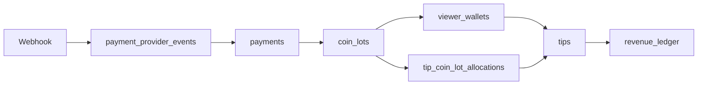

# TLV Payment Engine — TODO Phase 1 設計レポート

**日付:** 2026-06-28  
**対象:** TODO-01 · TODO-02 · TODO-04  
**正本:** `db/tlv_schema.sql` · `docs/TLV_PAYMENT_ENGINE.md` v1.1 · `docs/TLV_DB_SCHEMA.md` v1.2.2

---

## 1. 目的

TLV Payment/PL Engine 実装前に、以下の未確定事項を **既存 PRD/DB/TODO 正本に沿って** 解消する。

| ID | 内容 | 状態 |
| --- | --- | --- |
| TODO-01 | `viewer_wallets` / `coin_lots` | ✅ 解消 |
| TODO-02 | `payment_provider_events` 冪等 | ✅ 解消 |
| TODO-04 | tip 消費時 WR origin 追跡 | ✅ 解消 |

**変更していないもの:** PL/Score/Rank/還元率 · `payments`+`revenue_ledger` 責務分離 · `stream_events` 非金額正本

---

## 2. 追加テーブル概要

| テーブル | 責務 |
| --- | --- |
| `tlv.viewer_wallets` | Viewer ごとの `balance_coins` キャッシュ |
| `tlv.coin_lots` | 購入単位ロット · channel/gross/fee/net · FIFO 消費 |
| `tlv.payment_provider_events` | Stripe/IAP Webhook 冪等 |
| `tlv.tip_coin_lot_allocations` | tip がどの lot から何 coin 消費したか |
| `tlv.wallet_ledger` | 残高変動監査 |

**`tips` 拡張列:** `web_origin_coins` · `app_origin_coins` · `web_origin_net_jpy` · `app_origin_net_jpy` · `wr_at_tip`

---

## 3. TODO-01 — viewer_wallets / coin_lots

### 3.1 設計方針

- **残高正本:** `SUM(coin_lots.coins_remaining)` — `viewer_wallets.balance_coins` は集計キャッシュ（Phase 1 は DB trigger なし · アプリ層で同期）
- **1 payment → 通常 1 lot** — gross/fee/net を payments からコピー
- **welcome grant → lot** — `payment_id=NULL` · net=0 · `extension_allowed=false`

### 3.2 coin_lots 主要カラム

| カラム | 説明 |
| --- | --- |
| `payment_id` | 有償購入時 FK（welcome/ops は NULL 可） |
| `lot_source` | `web_stripe` / `ios_iap` / `android_iap` / `welcome_grant` / `ops_adjustment` |
| `is_web_payment` | WR 按分用（`web_stripe` のみ true） |
| `gross/fee/net_amount_jpy` | 購入時 PL |
| `coins_original` / `coins_remaining` | FIFO 消費単位 |
| `expires_at` | 有償 180d · welcome 30d（PRICING 準拠） |

### 3.3 FIFO

```text
ORDER BY expires_at ASC NULLS LAST, created_at ASC
WHERE coins_remaining > 0
```

---

## 4. TODO-02 — payment_provider_events 冪等

### 4.1 制約

- `(provider, provider_event_id)` **UNIQUE**
- `status=processed` の event 再送 → **200 OK · 副作用なし**

### 4.2 処理フロー

```text
Webhook受信
  → existing.status=processed ? return 200
  → INSERT/UPDATE event (processing)
  → TX: payments succeeded + coin_lots + wallet + ledger
  → event.status=processed
```

### 4.3 多層ガード

1. `payment_provider_events` UNIQUE
2. `payments.status=succeeded` ガード
3. 単一 DB トランザクション

---

## 5. TODO-04 — Web lot → tip WR 追跡

### 5.1 原則（PRD §5.2 追記）

**FS_WR の WR_30d は「購入時」ではなく「tip 消費時の coin lot origin」を正とする。**

混在 tip 例: Web lot 300 coin + App lot 200 coin で 500 coin tip

```text
web_origin_net  = floor(web_lot.net * 300/500) + ...
app_origin_net  = floor(app_lot.net * 200/500) + ...
wr_at_tip       = web_origin_net / (web_origin_net + app_origin_net)
```

### 5.2 tip_coin_lot_allocations

| カラム | 説明 |
| --- | --- |
| `tip_id` + `coin_lot_id` | UNIQUE（同一 tip から同一 lot は 1 行） |
| `coins_allocated` | 消費 coin 数 |
| `net_allocated_jpy` | `floor(lot.net * allocated / lot.coins_original)` |
| `is_web_origin` | lot から denormalize |

### 5.3 welcome lot

- `net_allocated_jpy = 0` — WR 分子・分母とも実質影響なし
- extension tip では `extension_allowed=false` のため **消費対象外**

### 5.4 Creator 集計

```text
WR_30d(C) = Σ tips.web_origin_net_jpy
          / max(Σ (web_origin_net_jpy + app_origin_net_jpy), 1)
          WHERE creator_id = C AND NOT fraud_excluded AND rolling 30d
```

---

## 6. データフロー（購入 → tip）



---

## 7. 完了条件チェックリスト

| 条件 | 状態 |
| --- | --- |
| coin 購入から tip 消費まで Web/App 由来を追跡できる | ✅ `coin_lots` + `tip_coin_lot_allocations` |
| Webhook 二重処理を防げる | ✅ `payment_provider_events` UNIQUE + TX |
| FS_WR 計算に使える lot origin が保存できる | ✅ `tips.*_origin_*` + allocations |
| Payment Engine 実装に進める | ✅ DDL + 処理仕様 v1.1 |

---

## 8. 未解消 TODO（Phase 1 対象外）

| ID | 内容 | 理由 |
| --- | --- | --- |
| TODO-03 | 疑義 tip ledger 計上タイミング | Ops ポリシー未確定 |
| TODO-05 | `streams.phase_ends_at` | `gauge_state.free_phase_ends_at` で代替中 |
| TODO-06 | chargeback クラウドバック | FinOps 手順待ち |
| TODO-07 | RLS | 別 migration |

---

## 9. 実装時 TODO 候補（設計未確定 · 勝手に実装しない）

| # | 内容 | 備考 |
| --- | --- | --- |
| CAND-01 | refund 時の lot  clawback 順序 | FIFO 逆順 vs 比例減算 — FinOps 要確認 |
| CAND-02 | `viewer_wallets` = lot 合計の DB trigger | Phase 1 はアプリ層 · 本番前に要検討 |
| CAND-03 | 失効 lot の自動処理ジョブ | `expires_at` 経過後の `coins_remaining` ゼロ化 |
| CAND-04 | 複数 lot からの tip で按分端数 | floor 余りを最後の allocation に寄せるルール要統一 |

---

## 10. 関連ファイル

| ファイル | 変更 |
| --- | --- |
| `db/tlv_schema.sql` | Phase 1.2.2 DDL 追記 |
| `docs/TLV_PAYMENT_ENGINE.md` | v1.1 · §1.8 · §2.6 · §9.1 |
| `docs/TLV_DB_SCHEMA.md` | v1.2.2 · 19 テーブル |
| `docs/TLV_PRD.md` | §5.2 WR 入力正本 1 段落追記 |
