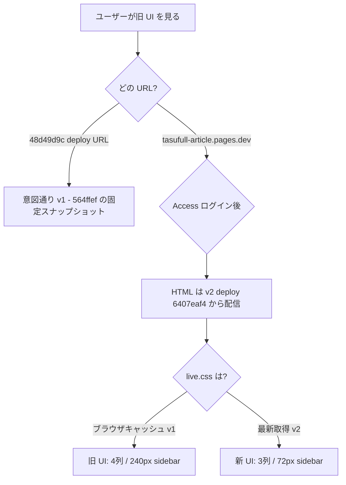

# TLV `/live/videos` Production 旧 UI 調査レポート

**実施日:** 2026-06-23  
**対象 URL:** `https://tasufull-article.pages.dev/live/videos`  
**調査トリガー:** Production で旧 UI（v1）が表示される一方、Clean URL 正規化（`/live/videos.html` → `/live/videos`）は正常と判明済み

---

## 結論（要約）

| 項目 | 結果 |
|------|------|
| Production Active deployment | **`5388084`（v2）— `564ffef` ではない** |
| Production deployment ID | **`6407eaf4-a226-4de9-8d44-2dc364a9b5d5`** |
| `48d49d9c` deploy URL | **旧 Production（`564ffef` / v1）のスナップショット** |
| Production alias の向き先 | **最新 deploy `6407eaf4` を指している（問題なし）** |
| HTML 差分 | deploy 間で **同一（4074 bytes）** — 差分は CSS/JS のみ |
| 旧 UI の主因（推定） | **ブラウザ/CDN による `live.css` / `live-videos.js` のキャッシュ**（`_headers` で `/*.css` が `max-age=3600` を適用） |

**Production alias は v2 を向いている。** `48d49d9c` は v1 の固定 deploy URL であり、Production と混同しないこと。Access ログイン後も旧 UI が見える場合は、キャッシュされた v1 アセット（CSS 約 60,120 bytes）が読み込まれている可能性が高い。

---

## 1. Cloudflare Pages Production Active deployment

`npx wrangler@4.103.0 pages deployment list --project-name tasufull-article`（2026-06-23 実施）:

| 順位 | Deployment ID | Environment | Branch | Commit | Deploy URL |
|------|---------------|-------------|--------|--------|------------|
| **1（Active）** | **6407eaf4** | Production | main | **5388084** | https://6407eaf4.tasufull-article.pages.dev |
| 2 | 7abc1a8e | Preview | cf-pages-deploy | 5388084 | https://7abc1a8e.tasufull-article.pages.dev |
| 3 | **48d49d9c** | Production | main | **564ffef** | https://48d49d9c.tasufull-article.pages.dev |
| 4 | 5fadec54 | Preview | cf-pages-deploy | 564ffef | https://5fadec54.tasufull-article.pages.dev |

### コミット対応

| Commit | メッセージ | UI 世代 |
|--------|-----------|---------|
| `564ffef` | Refine TLV videos feed YouTube-style cards | **v1**（1280=4列 / 1600=5列 / sidebar 240px） |
| `5388084` | Refine TLV videos layout to YouTube home style v2 | **v2**（1280=3列 / 1920=4列 / sidebar 72px） |

**→ Production Active は `564ffef` ではなく `5388084`。**

`48d49d9c` は `564ffef` 時点の **過去の Production deployment** で、immutable な deploy スナップショットとして残存している。

---

## 2. 配信 HTML / アセットの中身確認

### 2.1 HTML（deploy URL、Access なし）

`/live/videos` と `/live/videos.html` は Clean URLs により同一レスポンス（4074 bytes、`fc /b` で差分なし）。

```html
<link rel="stylesheet" href="live.css" />
<script src="live-videos.js" defer></script>
```

- キャッシュバスト用クエリなし（`?v=` なし）
- HTML 自体は v1/v2 で同一 — **見た目の差は CSS/JS の内容とキャッシュに依存**

### 2.2 `live/live.css` 比較

| マーカー | `48d49d9c`（564ffef / v1） | `6407eaf4`（5388084 / v2） | `dist/`（build:pages 後） |
|----------|---------------------------|---------------------------|--------------------------|
| ファイルサイズ | **60,214 bytes** | **62,358 bytes** | **62,358 bytes** |
| ETag | `69703ac4…` | `a629a523…` | — |
| `YouTube-style grid v2` コメント | ❌ | ✅ | ✅ |
| `--tlv-sidebar-w: 72px` | ❌ | ✅ | ✅ |
| `@media (min-width: 1920px)` + 4列 | ❌ | ✅ | ✅ |
| `@media (min-width: 1600px)` + 5列（v1） | ✅ | （v2 セクション内に残存するが 1920px ブロックが主） | — |
| 1280px = 3列（v2 feed） | 部分的 | ✅ | ✅ |

### 2.3 `live/live-videos.js` 比較

| マーカー | `48d49d9c`（v1） | `6407eaf4`（v2） | `dist/` |
|----------|------------------|------------------|---------|
| ファイルサイズ | 25,305 bytes | 25,155 bytes | 25,155 bytes |
| `.live-video-card--yt` in JS | ✅ | ✅ | ✅ |
| 統計 `viewsLabel・dateLabel`（中黒 `・`） | ❌ | ✅ | ✅ |

### 2.4 DOM 確認（Playwright @ 1280px、`?talkDev=1` 相当のモックデータ）

| Deploy | `.live-video-card--yt` | グリッド列（computed） | サイドバー幅 |
|--------|------------------------|------------------------|--------------|
| `48d49d9c` | ✅ 存在 | **4列**（236px × 4） | **240px** |
| `6407eaf4` | ✅ 存在 | **3列**（381px × 3） | **72px** |

**→ v1 と v2 の見た目差は CSS が決定的。JS の `--yt` クラスは両方に存在するが、v2 レイアウトは CSS のブレークポイントと sidebar 幅で判別できる。**

### 2.5 Production URL（`tasufull-article.pages.dev`）

未認証 fetch は **Cloudflare Access ログイン（302）** でブロック。HTML / CSS / JS の直接取得は不可。

- `/live/videos` → Access login redirect
- `/live/live.css` → Access login redirect（deploy サブドメインは Access 外のため直接取得可）
- `?v=5388084` / `?cachebust=5388084` → いずれも Access login（HTML キャッシュバストは未認証では検証不可）

**認証後の手動確認手順（推奨）:**

1. DevTools → Network → `live.css` の Size が **~62 KB（v2）** か **~60 KB（v1）** か確認
2. `live.css` レスポンス内に `--tlv-sidebar-w: 72px` と `min-width: 1920px` があるか検索
3. Elements に `.live-video-card--yt` があり、1280px で **3列** になるか確認

---

## 3. Deploy URL vs Production URL レスポンス差分

### 3.1 HTML

| URL | Status | Body | 備考 |
|-----|--------|------|------|
| `6407eaf4…/live/videos` | 200 | 4074 bytes | v2 deploy |
| `48d49d9c…/live/videos` | 200 | 4074 bytes | v1 deploy、**HTML は v2 と同一** |
| `tasufull-article.pages.dev/live/videos` | 302→Access | login page | 未認証 |

**HTML に差分はない。** 旧 UI に見える場合、アセットキャッシュが原因。

### 3.2 アセット（deploy サブドメイン、Access 外）

| アセット | `48d49d9c` ETag | `6407eaf4` ETag | 同一か |
|----------|-----------------|-----------------|--------|
| `live.css` | `69703ac4…` | `a629a523…` | **異なる（v1 vs v2）** |
| `live-videos.js` | `a6d2a46f…` | `8ed7e20d…` | **異なる** |

### 3.3 Clean URL 正規化

`/live/videos.html` → `/live/videos`（両 deploy で確認済み）。**URL 正規化は問題なし。**

---

## 4. Cloudflare キャッシュ調査

### 4.1 `_headers` の適用結果

`deploy/cloudflare/_headers` 定義:

```
/live/*
  Cache-Control: public, max-age=0, must-revalidate

/*.css
  Cache-Control: public, max-age=3600

/*.js
  Cache-Control: public, max-age=300
```

**実測レスポンスヘッダ（`6407eaf4…/live/live.css`）:**

```
Cache-Control: public, max-age=3600
```

| パス | 期待（`/live/*`） | 実際 |
|------|-------------------|------|
| `/live/videos`（HTML） | `max-age=0, must-revalidate` | ✅ 一致 |
| `/live/live.css` | `max-age=0`（意図） | ❌ **`max-age=3600`（`/*.css` が優先）** |
| `/live/live-videos.js` | `max-age=0`（意図） | ❌ **`max-age=300`（`/*.js` が優先）** |

**→ `/live/live.css` と `/live/live-videos.js` はデプロイ後最大 1 時間（CSS）/ 5 分（JS）ブラウザ・CDN にキャッシュされうる。** v1 → v2 切り替え直後に Access ログイン済みブラウザで旧 CSS が残るシナリオが成立する。

### 4.2 キャッシュバスト URL

| URL | 未認証結果 |
|-----|-----------|
| `/live/videos?v=564ffef` | Access login |
| `/live/videos?cachebust=564ffef` | Access login |

HTML にクエリを付けても Access は通過するが、**`live.css` / `live-videos.js` の URL は HTML 内でクエリなし**のため、アセットキャッシュはバイパスされない。

### 4.3 Cache purge

本調査では **Cache purge は未実施**（Wrangler からの一括パージは API トークン要）。ダッシュボードから以下をパージすれば v1 キャッシュは即消える:

- `https://tasufull-article.pages.dev/live/live.css`
- `https://tasufull-article.pages.dev/live/live-videos.js`

### 4.4 ユーザー側の即時確認

- **ハードリロード:** Ctrl+Shift+R（Mac: Cmd+Shift+R）
- **シークレットウィンドウ**で Access ログイン後に再確認
- Network タブで `live.css` を Disable cache 付きでリロード

---

## 5. `build:pages` 後 `dist/` の v2 確認

`deploy/cloudflare/dist/live/`（`npm run build:pages` 済み）:

| ファイル | サイズ | v2 マーカー |
|----------|--------|-------------|
| `live.css` | 62,358 bytes | ✅ `--tlv-sidebar-w: 72px`, `@media (min-width: 1920px)`, `YouTube-style grid v2` |
| `live-videos.js` | 25,155 bytes | ✅ `live-video-card--yt`, `viewsLabel・dateLabel` |

`dist/live/live.css` はソース `live/live.css` と一致（`cssMatchesSrc: true`）。

**ビルド成果物は v2 正。** デプロイ `6407eaf4` の配信内容とも一致。

---

## 6. Production deployment alias の向き先

Wrangler deployment list の **先頭 Production エントリ = Active alias**:

```
6407eaf4 → 5388084 (v2)  ← tasufull-article.pages.dev が向く先
48d49d9c → 564ffef (v1)  ← 過去 deploy（alias ではない）
```

**Production alias が旧 deploy `48d49d9c` を向いている証拠はなし。**  
ユーザーが `48d49d9c` の deploy URL を Production と混同している可能性が高い。

---

## 原因整理



| 仮説 | 判定 |
|------|------|
| Production が `564ffef` のまま | **❌ 否定** — Active は `5388084` |
| Clean URL 正規化の問題 | **❌ 否定** |
| Production alias が旧 deploy | **❌ 否定** — `6407eaf4` が Active |
| `48d49d9c` を Production と誤認 | **⚠️ 有力** |
| `live.css` / `live-videos.js` のキャッシュ | **⚠️ 有力** — `_headers` で CSS 1h キャッシュ |
| ビルド漏れ | **❌ 否定** — dist / 6407eaf4 とも v2 |

---

## 推奨アクション

### 即時（運用）

1. Production 確認は **`https://tasufull-article.pages.dev/live/videos`** を使用（`48d49d9c` は v1 固定 URL）
2. Access ログイン後、DevTools で `live.css` サイズ **~62 KB** を確認
3. ハードリロード or シークレットで再確認
4. 必要なら Cloudflare ダッシュボードで `/live/live.css` `/live/live-videos.js` をパージ

### 恒久（コード変更案 — 未実施）

`_headers` に `/live/*.css` と `/live/*.js` を **`/*.css` より前** に追加:

```
/live/*.css
  Cache-Control: public, max-age=0, must-revalidate

/live/*.js
  Cache-Control: public, max-age=0, must-revalidate
```

または `videos.html` のアセット URL にビルドハッシュ / コミット SHA を付与:

```html
<link rel="stylesheet" href="live.css?v=5388084" />
<script src="live-videos.js?v=5388084" defer></script>
```

---

## 検証コマンド・スクリプト

- `npx wrangler@4.103.0 pages deployment list --project-name tasufull-article`
- `node scripts/tmp-tlv-prod-investigate.mjs`（HTTP + Playwright DOM 比較、JSON 出力）
- 手動: `curl -sI https://6407eaf4.tasufull-article.pages.dev/live/live.css`

---

## 参照

- v2 レイアウト仕様: `reports/tlv-videos-youtube-layout-v2.md`
- v1 カード UI: `reports/tlv-videos-youtube-card-ui-result.md`
- Access 確認: `reports/tlv-production-access-visual-check.md`
