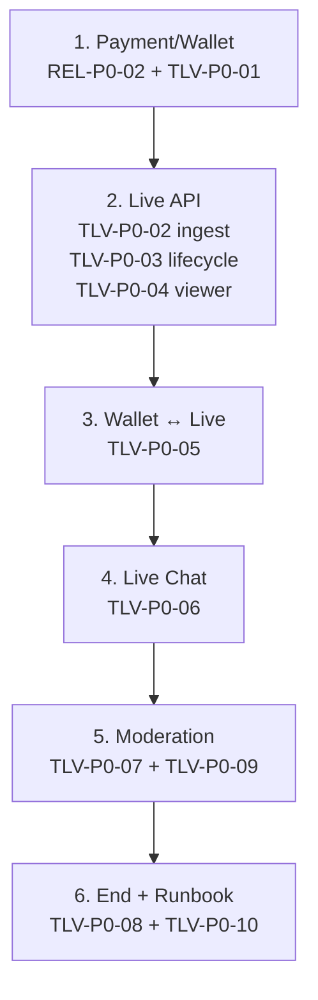

# TLV Release P0 Audit

**日付:** 2026-06-28  
**種別:** 整理のみ（実装 · migration · UI · Payment · Gateway **変更なし**）  
**入力:** [docs/TODO.md](../docs/TODO.md) · [TLV_PRD.md](../docs/TLV_PRD.md) · [TLV_PAYMENT_ENGINE.md](../docs/TLV_PAYMENT_ENGINE.md) · [TLV_DB_SCHEMA.md](../docs/TLV_DB_SCHEMA.md) · [ROADMAP.md](../docs/ROADMAP.md) · [todo-release-readiness-audit.md](./todo-release-readiness-audit.md)  
**注:** `docs/TLV_LIVE_CHAT.md` は **未作成**。Live Chat 設計は TODO §Live Chat System + `live/live-comments.js`（v1 最小）を監査代替とした。

---

## 1. 目的と判断基準

**目的:** TLV を **ライブ配信サービス**として本番公開する最低条件（Release P0）を明確化し、P1/Future との境界を固定する。

| 基準 | 分類 |
| --- | --- |
| ライブ配信として成立しない | **Release P0** |
| 収益 · 安全 · 決済に直結 | **Release P0** |
| 体験向上 · 差別化 | **Release P1** |
| 美顔など映像拡張 | **P1**（軽量映像補正 = **Decision 候補**） |
| AI 付加価値 · 30分サバイバル制度フル | **Future** |

---

## 2. 3 層スコープ（混同防止）

| 層 | 内容 | 状態 | 本監査 |
| --- | --- | --- | --- |
| **A** | TLV v1.0 静的ハブ（Shorts/VOD/stub 配信 UI） | ✅ Production Ready · **FEATURE FROZEN** | 対象外 |
| **B** | **収益ライブ MVP**（実映像 + coin + chat + 安全） | **未 Go** | **P0 正本** |
| **C** | PRD v2 制度（30分サバイバル · Gauge · Score · Legend） | 設計正本 · 実装 Future | REL-F-01/02 |

**アーキテクチャ二系統（接続 gap）**

| 系統 | スキーマ / コード | 用途 |
| --- | --- | --- |
| **live v1** | `public.live_broadcasts` · `live/` JS | v1 FROZEN UI · stub ingest · `live_tips` stub |
| **TLV Payment/PRD** | `tlv.streams` · `viewer_wallets` · Edge `tlv-*` | coin/tip/ledger · **UI 未接続** |

本番 MVP には **B 層の統合**（live UI ↔ tlv wallet ↔ 実 ingest）が P0 blocker。

---

## 3. P0 候補 8 領域 — 棚卸し結果

### 3.1 ライブ配信 API

| 項目 | 現状 | 判定 | 備考 |
| --- | --- | --- | --- |
| 配信開始 | `live-create.js` + `updateBroadcastStatus(live)` · DB 直更新 | **P0 不足** | Edge/RPC なし · creator gate のみ UI |
| 配信終了 | `updateBroadcastStatus(ended)` | **P0 不足** | 異常終了 · 冪等 close なし |
| 配信状態管理 | `live_broadcasts.status` | **部分** | `tlv.streams` 未使用 |
| 配信者権限 | `live_permission_status` gate | **部分** | migration **未本番適用**（DRAFT） |

→ **TLV-P0-01 / TLV-P0-02 / TLV-P0-03**

### 3.2 視聴 API

| 項目 | 現状 | 判定 |
| --- | --- | --- |
| 視聴開始/終了 | なし | **P0 不足** |
| 同時視聴数 | `peak_viewers` カラムのみ · 更新なし | **P0 不足** |
| 視聴者状態 | なし | **P0 不足** |

→ **TLV-P0-04**

### 3.3 ライブチャット

| 項目 | 現状 | 判定 |
| --- | --- | --- |
| 投稿/表示 | `live-comments.js` · `live_broadcast_messages` | **部分 Done** |
| NG ワード | なし | **P0 不足** |
| BAN / mute | TODO-CHAT-03 = **Future** | **P0 不足** |
| 最低限モデレーション | mod 削除なし | **P0 不足** |

→ **TLV-P0-06 / TLV-P0-07**（MVP chat + moderation）

### 3.4 投げ銭 / Wallet

| 項目 | 現状 | 判定 |
| --- | --- | --- |
| coin 購入 | `tlv-create-coin-purchase` **実装済** | **Done（開発）** · prod = REL-P0-02 |
| coin 残高 | `viewer_wallets` **実装済** | **Done（開発）** · Live UI 未接続 |
| 投げ銭 | `tlv-create-tip` + RPC **実装済** | **Done（開発）** · Live UI = stub |
| 二重消費防止 | idempotency + FOR UPDATE **実装済** | **Done** |
| ledger 監査 | `wallet_ledger` INSERT-only **実装済** | **Done** |

→ **TLV-P0-05**（Live ↔ Payment 接続が P0 blocker）

### 3.5 Payment

| 項目 | 現状 | 判定 |
| --- | --- | --- |
| checkout | Edge 実装済 | **Done（開発）** |
| webhook | 実装済 · **prod deploy 未** | **REL-P0-02** |
| runbook | [tlv-payment-production-readiness.md](./tlv-payment-production-readiness.md) | **REL-P0-02** |
| 本番 secret | Dashboard 未確認 | **REL-P0-02** |
| idempotency | Stripe event.id + client key | **Done** |

### 3.6 配信終了処理

| 項目 | 現状 | 判定 |
| --- | --- | --- |
| room close | status=ended のみ | **P0 不足** |
| viewer cleanup | なし | **P0 不足** |
| ledger 確定 | tip RPC は配信中 · 終了時集約なし | **P0 不足** |
| 異常終了 | 方針未整備 | **P0 不足** |

→ **TLV-P0-08**

### 3.7 管理・安全

| 項目 | 現状 | 判定 |
| --- | --- | --- |
| 配信停止 | なし | **P0 不足** |
| ユーザー BAN | なし（live 向け） | **P0 不足** |
| 通報 | VOD `live_video_reports`（P13） | **部分** · 配信向け不足 |
| 最低限ログ | Payment 監査あり · live session 弱い | **P0 不足** |
| RLS 確認 | Payment staging PASS · prod 適用待ち | **TLV-P0-01** |

→ **TLV-P0-09**

### 3.8 リリース対象外確認

| 機能 | 判定 | 正本 |
| --- | --- | --- |
| 美顔フィルター | **P1** · Decision 候補 | 本監査 §6 |
| 背景ぼかし | **P1** · Decision 候補 | 同上 |
| AI 字幕 | **Future** | TODO-CHAT / PRD |
| AI 翻訳 | **Future** | TODO-CHAT-12 |
| AI クリップ | **Future** | TODO §AI |
| Creator 高度分析 | **P1** | verify-live-youtube-p10 |
| イベント機能 | **Future** | PRD §10 P4 |

---

## 4. TLV 関連 TODO — サービス別再分類

### Release P0（blocker）

| ID | サービス | 由来 |
| --- | --- | --- |
| REL-P0-02 | Payment Runbook | 既存 Release Readiness |
| TLV-P0-01 | Live + Payment DB prod | 新規 · migration 状態 |
| TLV-P0-02 | 映像 ingest | 新規 · stub → Stream |
| TLV-P0-03 | 配信 lifecycle API | 新規 · live-broadcasts 拡張 |
| TLV-P0-04 | Viewer / CCU | 新規 |
| TLV-P0-05 | Wallet ↔ Live UI | 新規 · live-tips stub 置換 |
| TLV-P0-06 | Chat MVP | 新規 · live-comments 拡張 |
| TLV-P0-07 | Moderation MVP | 新規 · TODO-CHAT P1 から P0 最小を切出 |
| TLV-P0-08 | 配信終了処理 | 新規 |
| TLV-P0-09 | 管理・安全 | 新規 |
| TLV-P0-10 | Live Runbook | 新規 |

### Release P1

| 項目 | 代表 TODO |
| --- | --- |
| 映像拡張 | 美顔/背景ぼかし（Decision 候補） |
| Chat UX | TODO-CHAT-02,07,08,09 |
| Creator | 基本分析 · studio-analytics polish |
| Payment 後追い | chargeback prod registry · TODO-RLS-03 Admin E2E |
| 配信 polish | フォロワー限定 · 予約配信 |

### Future

| 項目 | 代表 |
| --- | --- |
| Live Chat 拡張 | TODO-CHAT-05〜20 |
| Membership | TODO-MEM-* |
| PRD 制度 | Gauge フル · Score · Legend · 30分サバイバル |
| AI 付加価値 | 字幕 · 翻訳 · クリップ · AI mod |
| IAP | CAND-P2-02 |

### Done（P0 から除外）

| 項目 | 根拠 |
| --- | --- |
| Payment Engine 開発 | Development Complete · staging PASS |
| TLV v1.0 静的 UI | FEATURE FROZEN · 9/9 Playwright |
| live-comments Phase 5 最小 | 投稿/自削除 |
| idempotency / 二重 tip 防止 | RPC v1.2.5 |

---

## 5. 既存 Release P0 との差分

| 観点 | Release Readiness 監査（2026-06-28） | 本監査（TLV Live） |
| --- | --- | --- |
| TLV 関連 P0 | **REL-P0-02 のみ**（Payment 運用） | **+ TLV-P0-01〜10**（ライブ本体） |
| 前提 | Payment Go = TLV 関連の唯一 blocker | Payment Go **必要だが不十分** |
| Live Chat | Future（TODO-CHAT 全体） | **MVP 最小 = P0**（投稿/表示/NG/BAN） |
| v1.0 FROZEN | 触らない | 統合は **v1.1+ 計画**として P0 に接続 gap を明記 |
| dist / UI 変更 | なし | なし（本監査） |

**結論:** [todo-release-readiness-audit.md](./todo-release-readiness-audit.md) の REL-P0-02 は **Wallet 本番化の必要条件**だが、**収益ライブサービス公開の十分条件ではない**。

---

## 6. Decision 候補（P0 に昇格しない）

| 候補 | 内容 | 理由 |
| --- | --- | --- |
| **軽量映像補正** | 美顔/背景ぼかしを初期差別化 | 配信成立の blocker ではない · P1 で A/B 判断 |
| **live vs tlv.streams 統合方針** | v1 `live_broadcasts` と `tlv.streams` の ID 正本 | 実装前に ADR 推奨 · 本監査では両方 gap を P0 に列挙 |
| **Gauge / 延長** | 30分サバイバル | MVP は「投げ銭 + 実配信」優先 · Gauge = P1/Future |

---

## 7. 推奨実装順（依存関係）

| 順 | フェーズ | 依存理由 |
| --- | --- | --- |
| 1 | **Payment/Wallet** | prod DB · webhook · coin 残高が tip の前提 |
| 2 | **Live API** | stream_id 正本 · 視聴 session が tip/chat の前提 |
| 3 | **Wallet ↔ Live** | 実 coin 消費は ingest + stream 確定後 |
| 4 | **Live Chat** | 配信 room が存在してから |
| 5 | **Moderation** | chat があるサービスに必須 |
| 6 | **End + Runbook** | 正常/異常終了 · ops 手順は全コンポーネント後 |

---

## 8. 参照コード・資料（監査時点）

| 資料 | 所見 |
| --- | --- |
| `live/live-broadcasts.js` | stub + `live_broadcasts` CRUD |
| `live/live-tips.js` | `live_tips` stub · Payment Engine 未使用 |
| `live/live-comments.js` | 最小 chat · mod/NG なし |
| `supabase/migrations/20260628100000_live_p0_schema.sql` | **DRAFT · NOT APPLIED** |
| `supabase/functions/tlv-*` | payment のみ（live lifecycle Edge なし） |
| [TLV_PAYMENT_ENGINE.md](../docs/TLV_PAYMENT_ENGINE.md) | Development Complete |
| [reports/tlv-release-status.md](./tlv-release-status.md) | v1.0 FROZEN |

---

## 9. 完了条件チェック

| 条件 | 状態 |
| --- | --- |
| TLV Release P0 明確化 | ✅ TLV-P0-01〜10 + REL-P0-02 |
| P1/Future 境界 | ✅ §3.8 · §4 |
| docs/TODO.md 更新 | ✅ TLV Release P0 セクション追加 |
| 本レポート | ✅ |
| 実装変更なし | ✅ |

---

## 10. 変更ファイル

| ファイル | 操作 |
| --- | --- |
| [docs/TODO.md](../docs/TODO.md) | TLV Release P0 セクション追加 · 索引更新 |
| [reports/tlv-release-p0-audit.md](./tlv-release-p0-audit.md) | 新規 |
