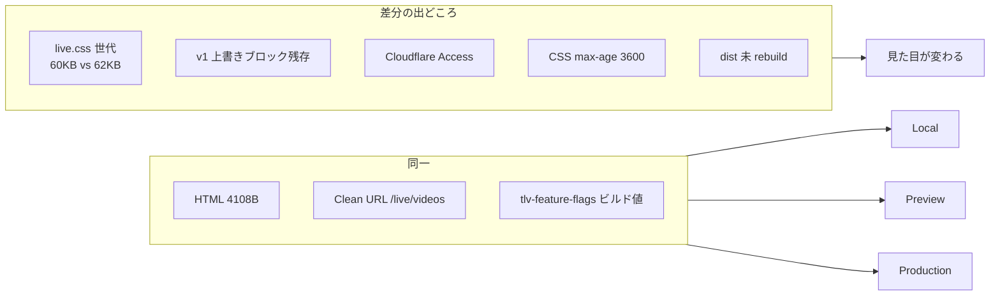

# TLV `/live/videos` — Local / Preview / Production 環境差分調査

**実施日:** 2026-06-23  
**対象ページ:** `/live/videos`（`live/videos.html` · VIEW フィード）  
**関連:** `reports/tlv-videos-v2-not-applied-root-cause.md`, `reports/global-local-preview-production-flow.md`

---

## URL 対応表

| 環境 | ベース URL | `/live/videos` 完全 URL | Access | 備考 |
|------|-----------|-------------------------|--------|------|
| **Local** | `http://127.0.0.1:8788` | `http://127.0.0.1:8788/live/videos?talkDev=1` | なし | Wrangler pages dev · dist 配信 |
| **Preview** | `https://{preview-id}.tasufull-article.pages.dev` | 同上 + `/live/videos?talkDev=1` | なし | branch: `cf-pages-deploy` |
| **Production** | `https://tasufull-article.pages.dev` | 同上（`talkDev` は任意） | **あり** | branch: `main` · alias |
| ~~旧スナップショット~~ | `https://48d49d9c.tasufull-article.pages.dev` | — | なし | **commit `564ffef` 固定 · 使用禁止** |
| 現行ビルド例 | `https://6407eaf4.tasufull-article.pages.dev` | — | なし | commit `5388084` · Production と同内容のはず |

### 現行 Deployment（2026-06-23 時点）

| Environment | Deployment ID | Commit | URL |
|-------------|---------------|--------|-----|
| **Production（Active）** | `6407eaf4` | `5388084` | `https://6407eaf4.tasufull-article.pages.dev` |
| Preview（直近） | `7abc1a8e` | `5388084` | `https://7abc1a8e.tasufull-article.pages.dev` |
| 旧 Production | `48d49d9c` | `564ffef` | v1 UI 固定 |

**Production alias:** `tasufull-article.pages.dev` → **`6407eaf4` / `5388084`**

---

## HTML — 3環境で同一か

| 項目 | Local（dist） | Preview deploy | Production alias |
|------|---------------|----------------|------------------|
| Clean URL | `/live/videos` ← `videos.html` | 同左 | 同左 |
| Body サイズ | 4108 bytes | 4108 bytes | 未認証時 Access login |
| `data-page="live-videos"` | ✅ | ✅ | ✅（HTML 上） |
| CSS 参照 | `live.css`（クエリなし） | 同左 | 同左 |
| JS 参照 | `live-videos.js`（クエリなし） | 同左 | 同左 |
| 追加 CSS | `../common-breadcrumb.css` | 同左 | 同左 |

**結論:** HTML 構造・参照アセットは deploy 間で同一。**見た目の差は CSS/JS の内容とキャッシュ・配信世代で決まる。**

---

## CSS / JS — 環境別差分

### `live.css` 識別

| 環境 / 世代 | 典型サイズ | `--tlv-sidebar-w: 72px` | `@media 1920px` 4列 | v1 上書き `@1600px` 5列 |
|-------------|-----------|--------------------------|---------------------|-------------------------|
| **Local src（修正後）** | **~61,848 B** | ✅ | ✅ | **削除済み** |
| **Local dist（未 rebuild）** | **~62,358 B** | ✅ | ✅ | ⚠️ 旧ブロック残存の可能性 |
| Preview / Prod `5388084` | **~62,262 B** | ✅ | ✅ | ⚠️ **残存（v2 未修正デプロイ）** |
| 旧 `564ffef` | **~60,120 B** | ❌ | ❌ | ✅（唯一のグリッド定義） |

> **注意:** ワークスペースの `live/live.css` に v1 上書きブロック削除が入っているが、**`npm run build:pages` 未実行のため dist は旧内容のまま**。Local `npm run dev` は **dist** を配信する。

### `live-videos.js`

| 環境 | サイズ目安 | `live-video-card--yt` | 統計 `・` 区切り |
|------|-----------|----------------------|------------------|
| v2 (`5388084`) | ~25,155 B | ✅ | ✅ |
| v1 (`564ffef`) | ~25,305 B | ✅ | ❌ |

### 計算済みレイアウト（Playwright · `?talkDev=1`）

| 環境 | 幅 | `data-page` | 列数 | サイドバー | 判定 |
|------|-----|-------------|------|-----------|------|
| v2 deploy `6407eaf4` | 1280 | あり | **3** | **72px** | v2 OK |
| v2 deploy `6407eaf4` | 1920 | あり | **4** | **72px** | v2 OK |
| v2 deploy `6407eaf4` | 1920 | **なし** | **5** | **240px** | v1 上書きブロック発動 |
| v1 deploy `48d49d9c` | 1920 | あり | **5** | **240px** | v1 CSS |
| Production（ユーザー報告） | 1920 | — | **5** | **240px** | **v1 相当** |

**本番 5列 + 240px = 次のいずれか:**

1. **v1 世代 `live.css`（~60KB）が配信されている**
2. v2 CSS だが **`body[data-page="live-videos"]` が効いていない**（HTML 以外の要因は未確認）
3. v2 CSS + **v1 上書きブロック残存** + `data-page` 欠落

---

## 適用 CSS カスケード（v2 deploy · 1920px）

`body[data-page="live-videos"]` **あり** のとき勝つルール:

```css
@media (min-width: 1920px) {
  body[data-page="live-videos"] .tlv-desktop-shell .tlv-videos-feed {
    grid-template-columns: repeat(4, minmax(0, 1fr)); /* 詳細度 (0,3,1) */
  }
}
```

**同ファイル内で後ろに残る v1 ルール（修正前）:**

```css
@media (min-width: 1600px) {
  .tlv-desktop-shell .tlv-videos-feed {
    grid-template-columns: repeat(5, minmax(0, 1fr)); /* 詳細度 (0,2,0) */
  }
}
```

| `data-page` | 1920px 結果 |
|-------------|-------------|
| あり | v2 が勝つ → **4列** |
| なし | v1 上書きが勝つ → **5列** |

**コード修正:** `live/live.css` から v1 上書きブロック（旧 L2256–2275）を削除済み。**Preview / Production へは `build:pages` → deploy が必要。**

---

## Feature Flags / Gate — 環境別

| 項目 | Local | Preview | Production |
|------|-------|---------|------------|
| 設定元 | `live/tlv-feature-flags.js` | `stage-cloudflare-pages.mjs` 生成 | 同左 |
| `publicEnabled` | `false` | `false`（env） | `false` |
| `privateTestEnabled` | `true` | `true` | `true` |
| `allowedTestEmails` | `rubi.hiro0613@gmail.com` | env | env |
| **Cloudflare Access** | なし | なし | **必須** |
| **tlv-private-test-gate** | localhost ではバナー弱 | `.pages.dev` でバナー | バナー + Access |
| **開発データ** | `?talkDev=1` | `?talkDev=1` | モックは本番 Supabase |

---

## Access / noindex / robots

| 制御 | Local | Preview | Production |
|------|-------|---------|------------|
| `<meta robots>` | `noindex,nofollow,noarchive,nosnippet` | 同左 | 同左 |
| `X-Robots-Tag` | 配信（dist `_headers`） | 同左 | 同左 |
| `robots.txt` | `Disallow: /` | 同左 | 同左 |
| 未認証 fetch | 200（HTML 取得可） | 200 | **302 → Access login** |

---

## キャッシュ — `/live/videos` 周辺

| アセット | ヘッダー（実測） | 環境差 |
|----------|------------------|--------|
| `/live/videos` HTML | `max-age=0, must-revalidate` | 3環境同設定 |
| `/live/live.css` | **`max-age=3600`**（`/*.css` が優先） | deploy 世代が異なると古い CSS が残る |
| `/live/live-videos.js` | **`max-age=300`** | 同上 |

**Local:** Wrangler dev は実質最新 dist を読むが、**dist 自体が古いと Local も古い UI**。

---

## 環境別 — 推奨確認手順

### Local

```powershell
npm run build:pages   # ソース変更のたび必須
npm run dev
# ブラウザ
http://127.0.0.1:8788/live/videos?talkDev=1
```

| 幅 | 期待 |
|----|------|
| 390 | モバイル 1列 |
| 1280 | **3列**, sidebar **72px** |
| 1920 | **4列**, sidebar **72px** |

```powershell
node scripts/tmp-tlv-v2-cascade-check.mjs
npm run verify:live-youtube-p15
```

### Preview

```powershell
git push origin HEAD:cf-pages-deploy
npx wrangler pages deployment list --project-name tasufull-article
# Preview URL を開く
https://{PREVIEW_ID}.tasufull-article.pages.dev/live/videos?talkDev=1
```

- Access なし → **UI 確認の正**
- DevTools Network: `live.css` Size が **~62KB**（v1 の ~60KB ではないこと）
- 390 / 1280 / 1920 スクリーンショット → `reports/tlv-videos-layout-v2-*.png`

### Production（完成版のみ）

```
https://tasufull-article.pages.dev/live/videos
```

1. Access ログイン
2. **レイアウト調整はしない**
3. DevTools 一回確認:
   - `live.css` Size ~62KB
   - 1920px で 4列 / sidebar 72px
4. 問題あれば **Local → Preview → 再 deploy**

---

## 差分サマリー



| 差分項目 | Local | Preview | Production |
|----------|-------|---------|------------|
| Access | ❌ | ❌ | ✅ |
| `talkDev=1` モック | ✅ 常用 | ✅ 常用 | 任意 |
| CSS 世代 | **dist 依存** | deploy commit 依存 | alias commit 依存 |
| UI 調整 | ✅ | ✅（確認のみ） | ❌ 禁止 |
| 5列になる条件 | dist が v1 / 旧 v2 | v1 deploy を見ている | v1 CSS or 旧 v2 + キャッシュ |

---

## 次のアクション

| # | 作業 | 担当 |
|---|------|------|
| 1 | `npm run build:pages` で v1 上書き削除を dist に反映 | 開発 |
| 2 | `cf-pages-deploy` → Preview で 1280/1920 確認 | 開発 |
| 3 | OK 後 `main` merge → Production | 開発 |
| 4 | `_headers` に `/live/*.css` `max-age=0` 追加 | 開発 |
| 5 | Production で `live.css` Size 一回確認 | 運用 |

---

## 参照ファイル

| パス | 役割 |
|------|------|
| `live/videos.html` | ページ本体 |
| `live/live.css` | グリッド・カードスタイル |
| `live/live-videos.js` | フィード DOM 生成 |
| `live/tlv-feature-flags.js` | ローカル flags |
| `live/tlv-private-test-gate.js` | 本番テストバナー |
| `deploy/cloudflare/stage-cloudflare-pages.mjs` | ビルド・flags 生成 |
| `deploy/cloudflare/_headers` | キャッシュポリシー |
| `scripts/tmp-tlv-v2-cascade-check.mjs` | 環境比較スクリプト |
