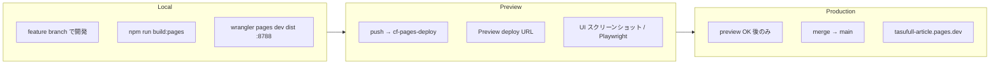

# TLV `/live/videos` v2 未適用 — 根本原因調査

**実施日:** 2026-06-23  
**症状:** 本番 `https://tasufull-article.pages.dev/live/videos` が v2 にならず、シークレットウィンドウでも **5列 / 240px サイドバー**（v1 相当）のまま  
**調査方針:** キャッシュではなく **CSS 適用・上書き・配信対象** として分析

---

## 結論（1行）

**5列表示は v1 CSS（`564ffef` 世代）が配信されているときの挙動と一致する。** 加えて v2 CSS 内に **v1 グリッド上書きルール（L2256–2275）が残っており**、`body[data-page="live-videos"]` が無い場合も同じ 5列になる。** 本番確認は DevTools で `live.css` サイズと `grid-template-columns` を見るのが確実。

---

## 1. 実際に適用されている `grid-template-columns`

Playwright + `?talkDev=1` で deploy URL を計測（Access なし、モックデータあり）。

| 条件 | Deploy | 幅 | `data-page` | 列数 | `grid-template-columns` | サイドバー |
|------|--------|-----|-------------|------|-------------------------|-----------|
| v2 CSS | `6407eaf4` | 1280 | あり | **3** | `381px × 3` | **72px** |
| v2 CSS | `6407eaf4` | 1920 | あり | **4** | `442px × 4` | **72px** |
| v2 CSS | `6407eaf4` | 1920 | **なし** | **5** | `313px × 5` | **240px** |
| v1 CSS | `48d49d9c` | 1280 | あり | **4** | `236px × 4` | **240px** |
| v1 CSS | `48d49d9c` | 1920 | あり | **5** | `313px × 5` | **240px** |

**本番で 5列 + 240px サイドバー** → 上表の **v1 CSS @1920** または **v2 CSS で `data-page` 欠落 @1920** と一致。

### 本番での DevTools 確認手順

1. Access ログイン後 `/live/videos` を開く
2. Elements: `<body data-page="live-videos">` があるか
3. Network: `live.css` の Size
   - **~62,262 bytes** → v2（`5388084`）
   - **~60,120 bytes** → v1（`564ffef`）← **5列の原因**
4. Console:
   ```js
   const f = document.querySelector('[data-live-videos-feed]');
   getComputedStyle(f).gridTemplateColumns;
   document.querySelector('.tlv-desktop-sidebar')?.getBoundingClientRect().width;
   document.body.getAttribute('data-page');
   ```
5. 期待値（v2・1920px）: **4列**, サイドバー **72px**, `data-page` = `"live-videos"`

---

## 2. `.tlv-videos-feed` / `.live-video-card--yt` に効いている CSS

### DOM 構造（`live-videos.js`）

```html
<div class="live-videos-feed tlv-videos-feed" data-live-videos-feed>
  <a class="live-video-card live-video-card--yt" …>
```

### カードスタイル（v2 ブロック L2015–2166）

| セレクタ | 内容 |
|----------|------|
| `.tlv-videos-feed .live-video-card--yt` | サムネ主役・透明背景・flex 縦並び |
| `.tlv-videos-feed .live-video-card__thumb` | `aspect-ratio: 16/9`, `border-radius: 10px` |
| `.tlv-videos-feed .live-video-card__avatar` | `32px` 円形 |
| `.tlv-videos-feed .live-video-card__stats` | `0.75rem`, 省略 |

**`.live-video-card--yt` は v1 / v2 両方の JS に存在**するため、**カードクラスの有無だけでは v2 判定不可**。グリッド列数とサイドバー幅で判定する。

### グリッド列（決定的な差）

| ルール位置 | セレクタ | 1280px | 1600px | 1920px | 2560px |
|-----------|----------|--------|--------|--------|--------|
| **v2** L2235–2253 | `body[data-page="live-videos"] .tlv-desktop-shell .tlv-videos-feed` | 3 | — | **4** | 5 |
| **v1 上書き（削除済）** 旧 L2256–2275 | `.tlv-desktop-shell .tlv-videos-feed` | 4 | **5** | **5** | 5 |
| レガシー L1048–1051 | `.live-videos-feed` | — | — | 3 (@1100px) | — |

v2 ルールは `body[data-page="live-videos"]` 付きで詳細度 **(0, 3, 1)**。v1 上書きは **(0, 2, 0)** のため、**`data-page` があれば v2 が勝つ**。  
**v1 CSS ファイル自体に v2 ブロックが無い**場合は、v1 上書きのみが効き **1920px で 5列**になる。

---

## 3. v2 CSS が読み込まれているか

### HTML が参照するアセット（`/live/videos` = `/live/videos.html`、同一 4108 bytes）

```html
<link rel="stylesheet" href="../common-breadcrumb.css" />
<link rel="stylesheet" href="live.css" />
…
<script src="live-videos.js" defer></script>
```

- クエリ付きバージョン指定なし
- 追加 CSS / JS なし
- `body` に `data-page="live-videos"` **静的に付与**（`live/videos.html` L15）

### 配信ファイルの識別（`live.css` サイズ）

| 世代 | Commit | 典型サイズ | v2 マーカー |
|------|--------|-----------|-------------|
| v1 | `564ffef` | **60,120 B** | `--tlv-sidebar-w: 72px` ❌ / `@media 1920px` 4列 ❌ |
| v2 | `5388084` | **62,262 B** | `--tlv-sidebar-w: 72px` ✅ / `@media 1920px` 4列 ✅ |

**本番 Network で 60,120 B なら v1 CSS が配信されている（キャッシュではなく配信対象の問題）。**

---

## 4. v2 より後に旧 CSS が上書きしていないか

### v2 CSS（`6407eaf4`）内のカスケード

v2 ブロック（L2228–2254）の **直後** に、v1 用の無条件ルール（旧 L2256–2275）が存在していた:

```css
/* v2 — 詳細度 (0,3,1) */
@media (min-width: 1920px) {
  body[data-page="live-videos"] .tlv-desktop-shell .tlv-videos-feed {
    grid-template-columns: repeat(4, minmax(0, 1fr));
  }
}

/* v1 上書き — 詳細度 (0,2,0)、ソース順で後ろ */
@media (min-width: 1600px) {
  .tlv-desktop-shell .tlv-videos-feed {
    grid-template-columns: repeat(5, minmax(0, 1fr));  /* ← 1920px でも有効 */
  }
}
```

| `data-page="live-videos"` | 1920px の結果 |
|---------------------------|---------------|
| **あり** | v2 が勝つ → **4列** |
| **なし** | v1 上書きが勝つ → **5列**、サイドバー **240px** |

**再現テスト（v2 deploy）:** `document.body.removeAttribute('data-page')` → 即 5列 / 240px に変化。

### その他の上書き候補

| ファイル | 該当 | 影響 |
|----------|------|------|
| `common-breadcrumb.css` | グリッド定義なし | なし |
| `.live-videos-feed` L1037–1051 | 詳細度低 | v2 body ルールに負ける |
| インライン style | なし | なし |

**結論:** v2 が効かない主因は (A) **v1 CSS ファイルの配信** または (B) **v1 上書きブロック + `data-page` 欠落**。本番 5列は **(A) の可能性が最も高い**（v1 CSS では `data-page` があっても 5列）。

---

## 5. `/live/videos` と `/live/videos.html` の HTML 差分

| URL | ステータス | 最終 URL | Body |
|-----|-----------|----------|------|
| `/live/videos` | 200 | `/live/videos` | 4108 B |
| `/live/videos.html` | 200 | `/live/videos`（正規化） | **同一** |

読み込み CSS/JS は同一。Clean URL は問題なし。

---

## 6. 1920px で 4列にならない原因

```mermaid
flowchart TD
  A[1920px で 5列] --> B{live.css サイズ}
  B -->|~60,120 B| C[v1 CSS 配信<br/>564ffef 世代]
  B -->|~62,262 B| D{body data-page}
  C --> E["@media 1600px → repeat(5)"]
  D -->|なし| F[v1 上書きブロック → repeat(5)]
  D -->|あり| G["v2 @1920px → repeat(4) ✓"]
```

| 原因 | 説明 | 本番との一致 |
|------|------|-------------|
| **① v1 CSS 配信** | v2 の `body[data-page]` ブロック自体が無い | **5列 + 240px** — **最有力** |
| **② v1 上書きブロック残存** | v2 CSS でも `data-page` 無しで 5列 | HTML には属性あり → 副次要因 |
| ③ ビューポート誤認 | 実幅 2560px+ なら v2 でも 5列は正常 | ユーザーは 1920px と報告 |
| ④ Clean URL / HTML 差分 | 同一ファイル | 否定 |

**Wrangler 上の Active Production:** `6407eaf4` / `5388084`（v2）。  
それでも本番で 60,120 B が見える場合 → **production alias と実配信の乖離**、または **Access 配下のエッジが旧デプロイ資産を返している**可能性をダッシュボードで再確認。

---

## 7. 修正案

### 7.1 CSS（コード修正 — 実施済み）

**`live/live.css` から v1 グリッド上書きブロック（旧 L2256–2275）を削除。**

```diff
- @media (min-width: 1024px) {
-   .tlv-desktop-shell .live-videos-feed,
-   .tlv-desktop-shell .tlv-videos-feed { grid-template-columns: repeat(3, …); }
- }
- @media (min-width: 1280px) { … repeat(4, …); }
- @media (min-width: 1600px) { … repeat(5, …); }
```

理由: v2 は `body[data-page="live-videos"]` スコープで完結。無条件 v1 ルールは landmine。

### 7.2 配信（本番反映前）

1. `npm run build:pages`
2. **Preview deploy URL** で UI 確認（下記フロー）
3. 問題なければ `main` へマージ → Production
4. 本番反映後 DevTools で `live.css` **62,262 B** を確認

### 7.3 `_headers`（推奨）

```
/live/*.css
  Cache-Control: public, max-age=0, must-revalidate

/live/*.js
  Cache-Control: public, max-age=0, must-revalidate
```

`/*.css`（max-age=3600）が `/live/live.css` に勝っている現状を修正。

### 7.4 アセットバージョニング（任意）

```html
<link rel="stylesheet" href="live.css?v=5388084" />
<script src="live-videos.js?v=5388084" defer></script>
```

---

## 環境分離フロー（local / preview / production）

今後 **本番運営中に UI を直接いじらない** ための運用。



| 環境 | URL | 用途 | UI 変更 |
|------|-----|------|---------|
| **Local** | `http://127.0.0.1:8788/live/videos?talkDev=1` | 実装・デバッグ | ✅ 可 |
| **Preview** | `https://{preview-id}.tasufull-article.pages.dev/live/videos` | **UI 確認の正** | ✅ deploy 毎 |
| **Production** | `https://tasufull-article.pages.dev/live/videos` | 完成版のみ | ❌ 直接いじらない |

**禁止:** Production でレイアウト確認しながら CSS を編集 → 再デプロイのループ。  
**禁止:** 旧 deploy URL（例: `48d49d9c`）を Production の代替として使う（immutable スナップショット）。

---

## Preview 専用 UI チェック手順

### 前提

- ブランチ `cf-pages-deploy` を push → Cloudflare が Preview deploy を生成
- Wrangler で Preview URL を取得:
  ```bash
  npx wrangler pages deployment list --project-name tasufull-article
  ```
  Environment = `Preview` の行を使用（Access なしで確認可）

### チェックリスト（`/live/videos?talkDev=1`）

| # | 項目 | 1280px 期待 | 1920px 期待 | 確認方法 |
|---|------|------------|------------|----------|
| 1 | `live.css` サイズ | ~62 KB | 同左 | Network |
| 2 | グリッド列数 | **3** | **4** | DevTools computed / Elements |
| 3 | サイドバー幅 | **72px** | **72px** | Elements → `.tlv-desktop-sidebar` |
| 4 | `.live-video-card--yt` | 存在 | 存在 | Elements |
| 5 | 統計表記 | `1.2万回視聴・4時間前` 形式 | 同左 | カードテキスト |
| 6 | `data-page` | `live-videos` | 同左 | `<body>` |
| 7 | Clean URL | `/live/videos` = `/live/videos.html` | 同左 | 両方開いて同一 |

### 自動検証（ローカル / CI 向け）

```bash
node scripts/tmp-tlv-v2-cascade-check.mjs
# または
npm run verify:live-youtube-p15
```

### Production へ上げる条件

- [ ] Preview deploy URL で上記 7 項目すべて PASS
- [ ] スクリーンショット `reports/tlv-videos-layout-v2-{390,1280,1920}.png` 更新
- [ ] `main` マージ後、Production で `live.css` **62,262 B** を DevTools 確認（1回のみ）

---

## 検証スクリプト

| ファイル | 用途 |
|----------|------|
| `scripts/tmp-tlv-v2-cascade-check.mjs` | v1/v2 deploy の列数・カスケード比較 |
| `scripts/tmp-tlv-prod-investigate.mjs` | HTTP + DOM プローブ |
| `reports/tlv-production-clean-url-cache-check.md` | 前回の deploy alias / キャッシュ調査 |

---

## 関連コミット

| Commit | 内容 |
|--------|------|
| `564ffef` | v1 カード UI（1280=4, 1600=5, sidebar 240px） |
| `5388084` | v2 レイアウト（1280=3, 1920=4, 2560=5, sidebar 72px） |
| （本修正） | v1 グリッド上書きブロック削除 |
