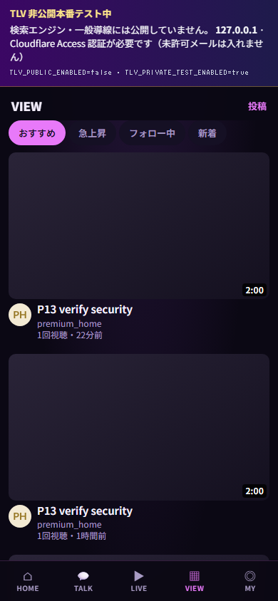
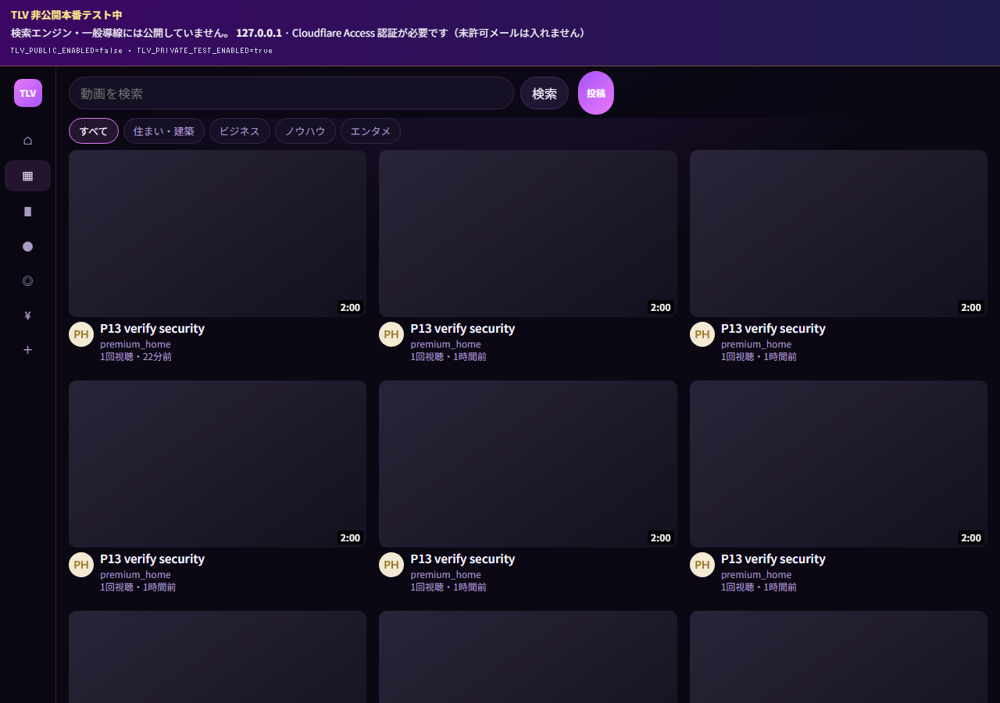
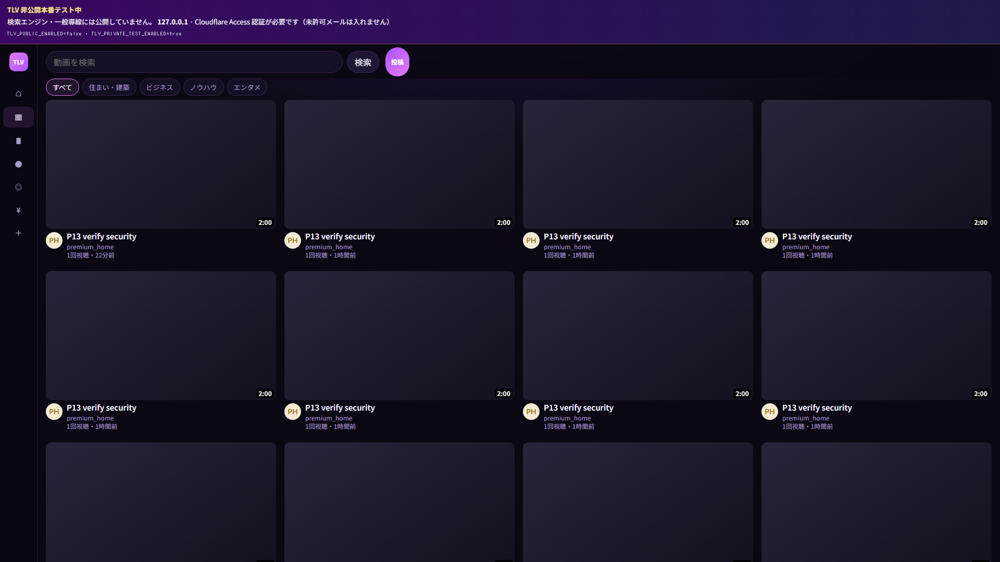

# TLV videos.html — YouTube ホーム寄せレイアウト v2

**実施日:** 2026-06-23  
**対象:** `/live/videos.html`（VIEW フィード）  
**変更ファイル:** `live/live-videos.js`, `live/live.css`

---

## 目的

v1 より **サムネイルを主役** にし、YouTube ホームと同様に「大きい動画カード + 最小限のメタ情報」へ寄せる。

---

## 変更サマリー

### グリッド列数（`body[data-page="live-videos"]` のみ）

| ビューポート | 列数 |
|--------------|------|
| 1024–1279px | 2列 |
| **1280–1919px** | **3列** |
| **1920–2559px** | **4列** |
| **2560px+**（超ワイド） | **5列** |

v1（1280px=4列 / 1600px=5列）より **1段階少ない列数** でカード幅を拡大。

### カード（サムネ主役）

- サムネ `16:9`・角丸 `10px`・カード上部を占有
- 情報欄: `padding-top: 4px`、アバター `32px`、コンパクト3行（タイトル / チャンネル / 統計）
- サムネ高さ / カード高さ ≈ **78–81%**（実測）
- 行間 `24px`、列間 `16px`（v1 の 40px 行間から縮小）

### タイポグラフィ

| 要素 | 仕様 |
|------|------|
| タイトル | `0.9375rem`（15px）・太字・最大2行 |
| チャンネル名 | `0.75rem`・1行省略（`ellipsis`） |
| 視聴・日付 | `1.2万回視聴・4時間前` 形式（中黒 `・`） |

### ページ chrome（videos のみ）

| 項目 | 変更 |
|------|------|
| 左サイドバー | `72px` アイコンのみ（YouTube ミニドロワー相当） |
| トップバー | タイトル非表示・縦 padding 縮小 |
| カテゴリチップ | 下余白 `8px` |
| メイン padding | `16px` 横 |

### 変更していないもの

- Cloudflare Access / `TLV_PUBLIC_ENABLED=false` / `TLV_PRIVATE_TEST_ENABLED=true`
- noindex / robots.txt / private test banner
- `videos.html` / `tlv-feature-flags.js` / `tlv-private-test-gate.js`

---

## スクリーンショット

### 390px（モバイル・1列）



- 1列縦型カード
- サムネ全幅 16:9
- private test banner 維持

### 1280px（デスクトップ・3列）



- **3列**グリッド
- サイドバー **72px**
- 検索 + チップの縦余白縮小

### 1920px（ワイド・4列）



- **4列**グリッド
- カード幅拡大によりサムネがより主役に

---

## 自動計測（ローカル `?talkDev=1`）

| ビューポート | 列数 | サイドバー実幅 | サムネ/カード高比 | 統計行サンプル |
|--------------|------|----------------|-------------------|----------------|
| 390px | 1 | —（モバイル） | 78% | `1回視聴・21分前` |
| 1280px | 3 | 72px | 79% | `1回視聴・21分前` |
| 1920px | 4 | 72px | 81% | `1回視聴・21分前` |

`TLV_FEATURE_FLAGS`: `publicEnabled: false`, `privateTestEnabled: true`  
private test banner: 全ビューポートで表示確認

---

## 確認手順

```powershell
npm run build:pages
npx wrangler pages dev deploy/cloudflare/dist --port 8788 --ip 127.0.0.1
# http://127.0.0.1:8788/live/videos.html?talkDev=1
```

DevTools で幅 390 / 1280 / 1920 を切り替え、列数とサムネサイズを目視確認。

---

## 備考

- チャンネルプロフィール等の `.tlv-channel-grid` は対象外（VIEW フィードのみ）
- 本番反映には commit / push が別途必要
